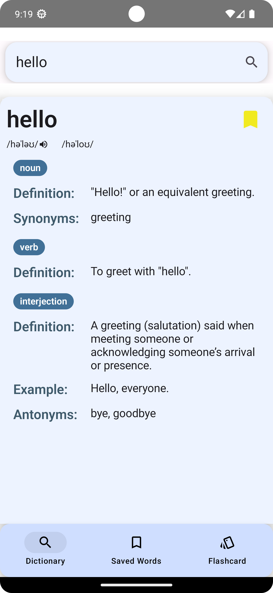
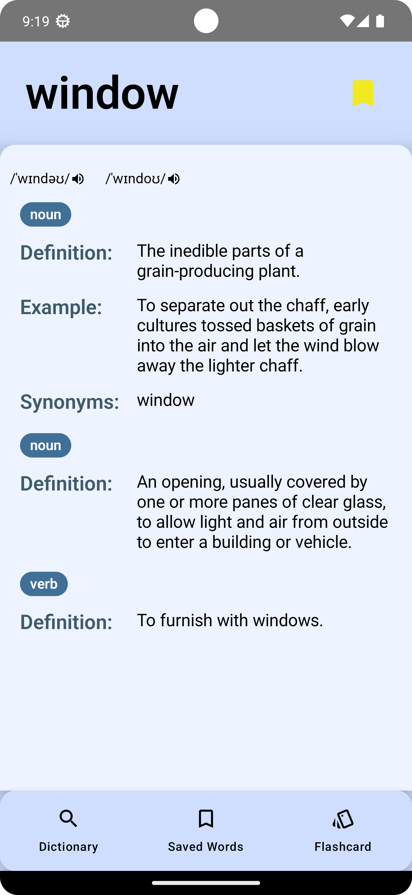
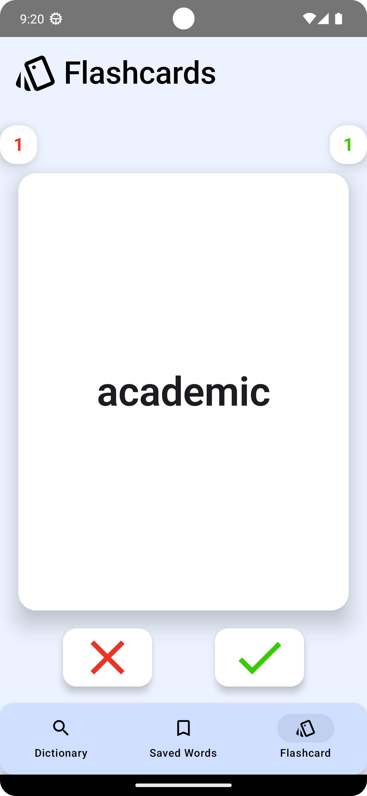
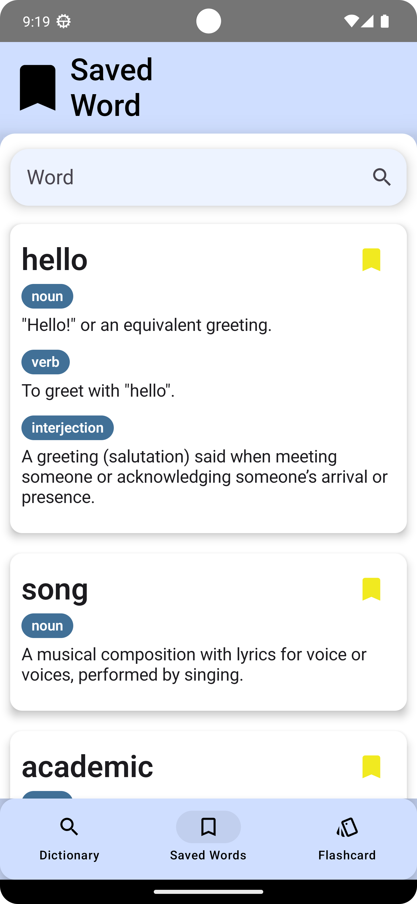
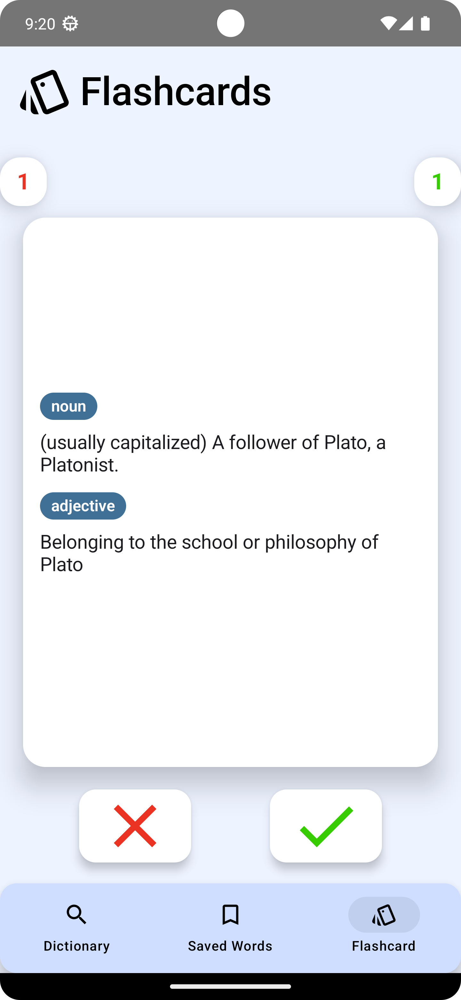

# English Dictionary App
<<<<<<< HEAD

A modern, feature-rich English Dictionary Android application designed to help users look up word definitions, manage vocabulary, and enhance their English learning experience.

## Features

- **Word Search:** Quickly search for English word definitions and pronunciations.
- **Flashcards:** Create and review flashcards to memorize vocabulary efficiently.
- **Save Words:** Bookmark and organize words for future reference.
- **User-Friendly Interface:** Clean, intuitive, and responsive UI for seamless navigation.
- **Offline Support:** Access saved words and flashcards without an internet connection.

## Screenshots

| Main Screen | Detail Screen | Flash Card | Save Word |
|-------------|--------------|------------|-----------|
|  |  |  |  |

## Getting Started

### Prerequisites
- Android Studio (latest version recommended)
- Android SDK
- Gradle

### Installation
1. Clone the repository:
   ```sh
   git clone <repository-url>
   ```
2. Open the project in Android Studio.
3. Build and run the app on an emulator or physical device.

## Project Structure

- `app/src/main/java/` - Application source code
- `app/src/main/res/` - Resources (layouts, drawables, etc.)
- `app/src/main/AndroidManifest.xml` - App manifest
- `build.gradle.kts` - Project build configuration

## Contribution

Contributions are welcome! Please fork the repository and submit a pull request for any improvements or bug fixes.

## License

This project is licensed under the MIT License.
=======
## UI     
<div style="display: flex; gap: 5px; justify-content: center; flex-wrap: nowrap;">
  
  
  
  
  
</div>

## Overview
* Our English Dictionary mobile app is a powerful tool designed to help users enhance their vocabulary and language skills.
The app allows users to look up words and provides detailed English definitions along with accurate pronunciation.
Additionally, users can save important words to their personal list for future reference. To support effective learning,
the app includes a flashcard feature, enabling users to memorize and review words interactively. With an intuitive interface
and essential language-learning features, this app is an excellent companion for students, professionals, and language enthusiasts.
## Features
* 📖 **Word Lookup** – Search for words and get detailed English definitions.
* 🔊 **Accurate Pronunciation** – Listen to the correct pronunciation of words.
* ⭐ **Save Important Words** – Create a personal word list for future reference.
* 🎴 **Flashcard Learnin**g – Memorize and review words interactively using flashcards.
## Technologies
* **Kotlin:** Programming language.
* **Jetpack Compose:** For building the UI.
* **Kotlin Coroutine:** For asynchronous programming.
* **MVVM:** Architectural pattern.
* **Room Database:** Local data storage.
* **Retrofit:** For making network requests.
* **OkHttp:** For making HTTP requests and managing connections.
>>>>>>> 2339bdda5f5fd74226ffb9a9efe130451ca7730d
