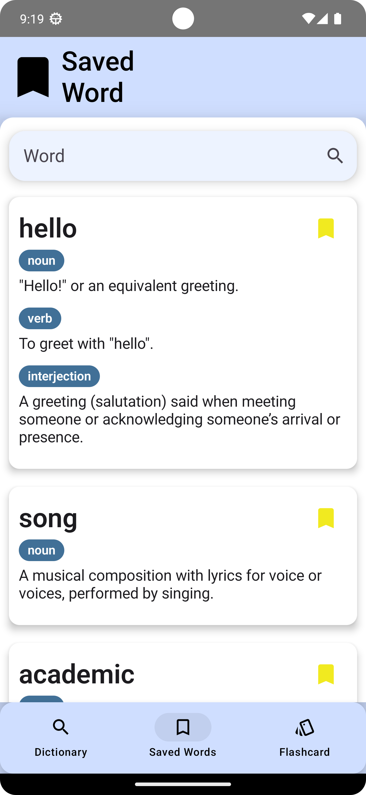

# English Dictionary App
## UI     

  
  
  
  
  

## Overview
* Our English Dictionary mobile app is a powerful tool designed to help users enhance their vocabulary and language skills.
The app allows users to look up words and provides detailed English definitions along with accurate pronunciation.
Additionally, users can save important words to their personal list for future reference. To support effective learning,
the app includes a flashcard feature, enabling users to memorize and review words interactively. With an intuitive interface
and essential language-learning features, this app is an excellent companion for students, professionals, and language enthusiasts.
## Features
* 📖 **Word Lookup** – Search for words and get detailed English definitions.
* 🔊 **Accurate Pronunciation** – Listen to the correct pronunciation of words.
* ⭐ **Save Important Words** – Create a personal word list for future reference.
* 🎴 **Flashcard Learnin**g – Memorize and review words interactively using flashcards.
## Technologies
* **Kotlin:** Programming language.
* **Jetpack Compose:** For building the UI.
* **Kotlin Coroutine:** For asynchronous programming.
* **MVVM:** Architectural pattern.
* **Room Database:** Local data storage.
* **Retrofit:** For making network requests.
* **OkHttp:** For making HTTP requests and managing connections.
